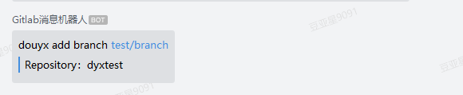
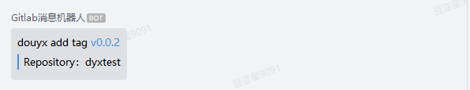
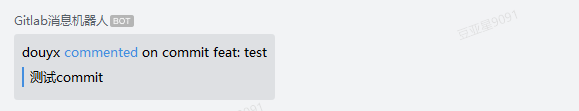
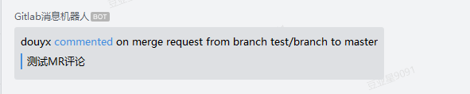
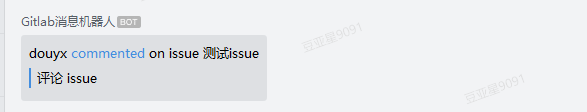
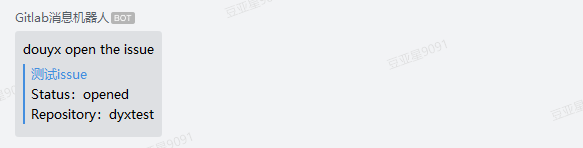
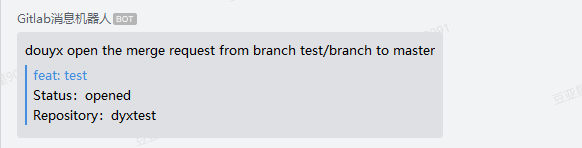
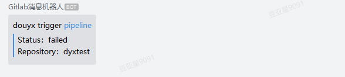
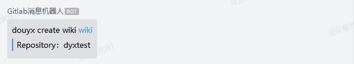

# gitlab推送企业微信群组机器人
> 支持gitlab所有触发动作

### 推送显示示例如下
#### 分支相关操作


#### tag相关操作


#### 评论操作
- 评论 commit

- 评论 Merge Request

- 评论 issue


#### issue相关操作


#### Merge Request 相关操作


### Pipeline 相关操作

#### wiki 相关操作


### 微信群组添加机器人
> 参考[群机器人配置说明](https://work.weixin.qq.com/api/doc/90000/90136/91770)

### 使用docker部署项目
> docker-compose up --build -d

通过:7001端口访问服务即可

### gitlab设置webhooks
1. 进入项目 设置 => 集成
2. url填写自己服务部署的地址，以服务部署地址为 `http://100.10.10.100:7001` 为例
```
// 微信群组机器人的webhookUrl
https://qyapi.weixin.qq.com/cgi-bin/webhook/send?key=ajs2w1o3102ndas9u121aw1u20
 
// gitlab集成设置的url，api调用路径最后使用微信群组的key即可
http://100.10.10.100:7001/send/ajs2w1o3102ndas9u121aw1u20
```
3. 选择需要触发推送的操作保存设置即可

