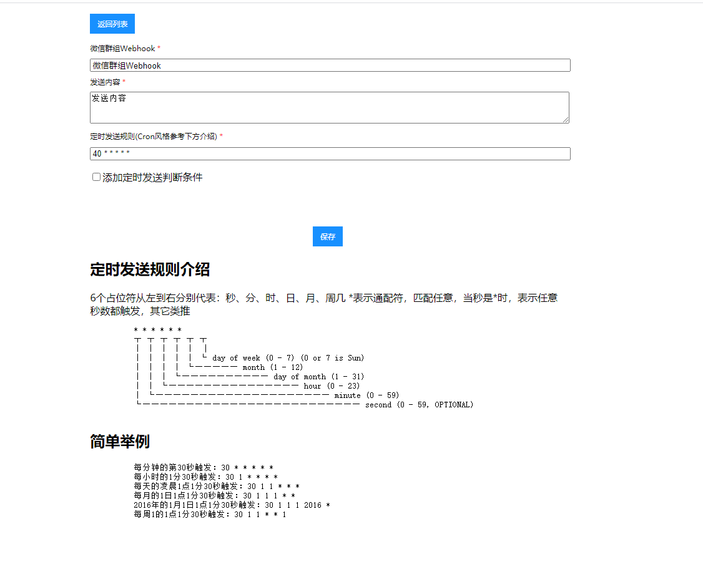

# 向企业微信群组推送消息
> 通过配置Webhook的方式，将GitLab平台、Jira平台中操作产生的事件消息通知，自动推送至企业微信群组，并提供定时任务消息通知功能。

## 我们支持的功能
1. GitLab相关操作推送企业微信群组
2. Jira相关操作推送企业微信群组
3. 配置定时任务消息推送企业微信群组

## 创建企业微信群组机器人
1. 使用管理员身份登录企业微信移动客户端
2. 进入需要添加机器人的群组，进入群组设置，添加群组机器人
3. 添加成功后，复制Webhook 地址

## 配置GitLab项目Webhook
> 以服务部署地址http://100.10.10.100:7001为例

1. 使用**Maintainer身份**进入GitLab需要添加自动推送的项目，进入设置 => 集成 。
2. 配置Webhook，如企业微信群组机器人Webhook地址为 `https://qyapi.weixin.qq.com/cgi-bin/webhook/send?key=ce7axxa2-2xx9-4xx5-axx4-aexxxx3cd89c`，将问号后的key值与服务部署地址拼接为` http://100.10.10.100:7001/send/ce7axxa2-2xx9-4xx5-axx4-aexxxx3cd89c`，作为地址填入URL，如下图:

3. 勾选需要进行消息推送的Trigger。**注意：取消勾选‘Enable SSL verification’**。点击**Add Webhook**按钮，完成配置。

## 配置Jira的Webhook
> 以服务部署地址http://100.10.10.100:7001为例

1. 使用**管理员身份**进入 管理 → 系统 → 网络钩子
2. 配置Webhook，如企业微信群组机器人Webhook地址为 `https://qyapi.weixin.qq.com/cgi-bin/webhook/send?key=ce7axxa2-2xx9-4xx5-axx4-aexxxx3cd89c`，将问号后的key值与服务部署地址拼接为 `http://100.10.10.100:7001/jira/send/ce7axxa2-2xx9-4xx5-axx4-aexxxx3cd89c`，作为地址填入URL，**注意：不要在URL中使用额外变量**。

3. 勾选需要进行消息推送的事件。支持 **问题相关事件的问题事件**、**项目相关事件**、**用户相关事件**、**Jira Software相关事件**。点击创建按钮，完成配置。

## 配置定时任务消息通知
> 目前只支持文本类型，服务启动会默认开启所有设置为开启状态的定时任务。

### 可视化配置形式
#### 查看所有定时任务情况以及开启状态  /job/view/list

#### 添加定时任务  /job/view/add


### API调用形式（Get请求）
#### 查看所有定时任务情况  /job/list

**返回值**
```
{ "data": [
    { 
       "url": "推送地址webhook",
       "content": "推送内容",
       "cron": "40 * * * * *",
       "options": "",
       "id": 1,
       "isStarting": 1
    }
  ]
}
```
**返回值说明**

| 参数 | 类型 | 说明 |
| --- | --- | --- |
| url | string | 微信群组Webhook_url |
| content | string | 推送消息 |
| cron | string | 定时发送规则(Cron风格) |
| options | string | 定时发送判断条件(isSendDaily: 工作日发送消息，考虑节假日调休情况; isSendWeekly: 每周最后一个工作日发送消息，节假日调休情况) |
| isStarting | number | 任务是否在运行中(0: 定时任务没有运行; 1: 定时任务运行中) |

#### 添加定时任务  /job/add?url=xxx&content=xxx&cron=xxx&options=xxx
> 默认新添的定时任务会自动启动

**接口入参**

| 参数 | 类型 | 是否必选 | 说明 |
| --- | --- | --- | --- |
| url | string | true | 微信群组Webhook_url |
| content | string | true | 推送消息 |
| cron | string | true | 定时发送规则(Cron风格) |
| options | string | false | 定时发送判断条件(isSendDaily: 工作日发送消息，考虑节假日调休情况; isSendWeekly: 每周最后一个工作日发送消息，节假日调休情况) |

**返回值**
```
{ "data": true }
```
**返回值说明**

| 参数 | 类型 | 说明 |
| --- | --- | --- |
| data | boolean | 是否添加成功 |

#### 更新定时任务  /job/update?url=xxx&content=xxx&cron=xxx&id=xxx&options=xxx
> 默认更新后的定时任务会处于启动状态

**接口入参**

| 参数 | 类型 | 是否必选 | 说明 |
| --- | --- | --- | --- |
| url | string | true | 微信群组Webhook_url |
| content | string | true | 推送消息 |
| cron | string | true | 定时发送规则(Cron风格) |
| id | number | true | 所要更新任务的id |
| options | string | false | 定时发送判断条件(isSendDaily: 工作日发送消息，考虑节假日调休情况; isSendWeekly: 每周最后一个工作日发送消息，节假日调休情况) |

**返回值**
```
{ "data": true }
```
**返回值说明**

| 参数 | 类型 | 说明 |
| --- | --- | --- |
| data | boolean | 是否更新成功 |

#### 删除定时任务 /job/delete?jobId=xxx
> 删除此定时任务的配置信息，并停止该定时任务的运行

**接口入参**

| 参数 | 类型 | 是否必选 | 说明 |
| --- | --- | --- | --- |
| jobId | number | true | 所要删除任务的id |


**返回值**
```
{ "data": true }
```
**返回值说明**

| 参数 | 类型 | 说明 |
| --- | --- | --- |
| data | boolean | 是否删除成功 |

#### 查询定时任务详情 /job/detail?jobId=xxx

**接口入参**

| 参数 | 类型 | 是否必选 | 说明 |
| --- | --- | --- | --- |
| jobId | number | true | 所要查询详情的任务id |


**返回值**
```
{ "data": { 
    "url": "推送地址webhook",
    "content": "推送内容",
    "cron": "40 * * * * *",
    "options": "",
    "id": 1,
    "isStarting": 1
  }
}
```
**返回值说明**

| 参数 | 类型 | 说明 |
| --- | --- | --- |
| url | string | 微信群组Webhook_url |
| content | string | 推送消息 |
| cron | string | 定时发送规则(Cron风格) |
| options | string | 定时发送判断条件(isSendDaily: 工作日发送消息，考虑节假日调休情况; isSendWeekly: 每周最后一个工作日发送消息，节假日调休情况) |
| isStarting | number | 任务是否在运行中(0: 定时任务没有运行; 1: 定时任务运行中) |

#### 停止定时任务 /job/stop?jobId=xxx
> 停止定时任务，不会删除配置还可以重启此定时任务

**接口入参**

| 参数 | 类型 | 是否必选 | 说明 |
| --- | --- | --- | --- |
| jobId | number | true | 所要停止的任务id |


**返回值**
```
{ "data": true }
```
**返回值说明**

| 参数 | 类型 | 说明 |
| --- | --- | --- |
| data | boolean | 是否停止成功 |

#### 重启定时任务 /job/restart?jobId=xxx

**接口入参**

| 参数 | 类型 | 是否必选 | 说明 |
| --- | --- | --- | --- |
| jobId | number | true | 所要重启的任务id |


**返回值**
```
{ "data": true }
```
**返回值说明**

| 参数 | 类型 | 说明 |
| --- | --- | --- |
| data | boolean | 是否重启成功 |


## 项目部署
**使用egg-scripts直接部署项目**
1. npm install
2. npm start

**使用docker部署项目**
> docker-compose up --build -d

通过:7001端口访问服务即可


